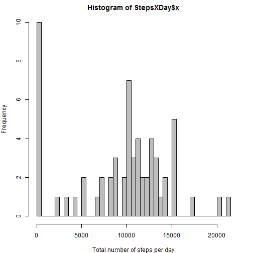
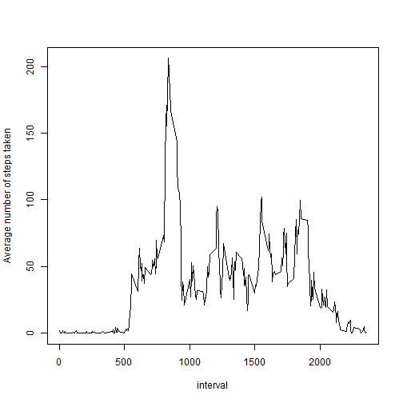
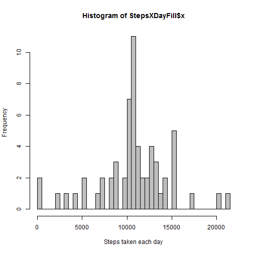
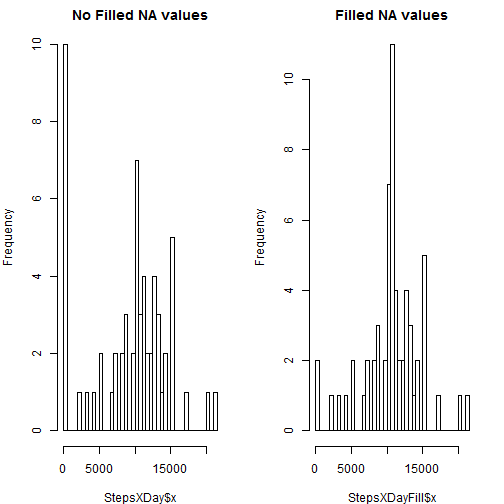

###What is mean total number of steps taken per day?

Load and set the data

```r
data<-read.csv("activity.csv")
data$date<-as.Date(data$date, format="%Y-%m-%d")
```

Calculate the Sum of steps per day

```r
StepsXDay<-aggregate(data$steps,by=list(data$date),FUN=sum,na.rm=TRUE)
par(mar=c(4,4,2,2))
hist(StepsXDay$x,breaks=60, col="grey",xlab="Total number of steps per day")
```

 

Mean steps per day

```r
mean(StepsXDay$x,na.rm=TRUE)
```

```
## [1] 9354.23
```

Median steps per day

```r
median(StepsXDay$x,na.rm=TRUE)
```

```
## [1] 10395
```


###What is the average daily activity pattern?

Plot 5-minute interval and the average number of steps taken, averaged across all days

```r
stepsInterval<-aggregate(data$steps,by=list(data$interval),FUN=mean,na.rm=TRUE)
names(stepsInterval)<-c("interval", "meanSteps")
plot(stepsInterval,type="l", ylab="Average number of steps taken")
```

 

Which 5-minute interval, on average across all the days in the dataset, contains the maximum number of steps

```r
subset(stepsInterval,stepsInterval$meanSteps==max(stepsInterval$meanSteps))
```

```
##     interval meanSteps
## 104      835  206.1698
```


###Imputing missing values


Number of rows with steps value = NA

```r
stepsNA<-subset(data,is.na(data$steps))
nrow(stepsNA)
```

```
## [1] 2304
```

Fill in all NA values in the data set

```r
##Find any NA values
sapply(data, function(x) sum(is.na(x)))
```

```
##    steps     date interval 
##     2304        0        0
```

```r
##The idea here is to eplace missing values with the value of the mean of 5 min interval previously calculated.
##The Strategy is to merge the original data set with a column containing the meaning of 5 min interval. Then, when there is a NA value it is replaced by the value in the same row of the new column previously added with the merge function
mean5minInterval<-aggregate(data$steps,by=list(data$interval),FUN=mean,na.rm=TRUE)
names(mean5minInterval)<-c("interval", "meanSteps")
mergeDF<-merge(data, mean5minInterval, by.x = "interval", by.y = "interval")
mergeDFSorted<-mergeDF[order(mergeDF$date),]
mergeDFSorted$steps<-as.numeric(mergeDFSorted$steps)
mergeDFSorted$steps[is.na(mergeDFSorted$steps)]<-mergeDFSorted$meanSteps
```

Create a new dataset that is equal to the original dataset but with the missing data filled in

```r
filledDF<-mergeDFSorted[c("steps","date","interval")]
```

Make a histogram of the total number of steps taken each day

```r
StepsXDayFill<-aggregate(filledDF$steps,by=list(filledDF$date),FUN=sum)
hist(StepsXDayFill$x,breaks=60, col="grey",xlab="Steps taken each day")
```

 

Mean steps per day Filled dataset

```r
mean(StepsXDayFill$x)
```

```
## [1] 10766.19
```

Median steps per day Filled dataset

```r
median(StepsXDayFill$x)
```

```
## [1] 10766.19
```

Question:
 Do these values differ from the estimates from the first part of the assignment? What is the impact of imputing missing data on the estimates of the total daily number of steps?

 Answer:
 Yes, they differ a little bit. After filling in the NA values, the mean and median values are higher because the original NA values are evaluated as 0 when aggregating rows by date.
 
Differences between 2 histograms

```r
par(mfrow=c(1,2),mar=c(4,4,2,2))
hist(StepsXDay$x,breaks=60,main="No Filled NA values")
hist(StepsXDayFill$x,breaks=60,main="Filled NA values")
```

 

###Are there differences in activity patterns between weekdays and weekends?

Create a new factor variable in the dataset with two levels - "weekday" and "weekend" indicating whether a given date is a weekday or weekend day.

```r
filledDF$weekdays<-weekdays(filledDF$date)
wedays<-c("lunes","martes","miércoles","jueves","viernes")
weend<-c("sábado","domingo")
filledDF$weekdays[filledDF$weekdays %in% wedays]<-"weekday"
filledDF$weekdays[filledDF$weekdays %in% weend]<-"weekend"
filledDF$weekdays<-as.factor(filledDF$weekdays)
```
Make a panel plot containing a time series plot (i.e. type = "l") of the 5-minute interval (x-axis) and the average number of steps taken, averaged across all weekday days or weekend days (y-axis). 

```r
stepsInterWdays<-aggregate(steps ~ interval+weekdays,data=filledDF,FUN=mean)
par(mar=c(4,4,4,4))
library(lattice)
```

```
## Warning: package 'lattice' was built under R version 3.1.3
```

```r
xyplot(steps ~ interval | weekdays, data=stepsInterWdays, layout = c(1, 2),type="l",xlab="Interval", ylab="Number of Steps")
```

 
